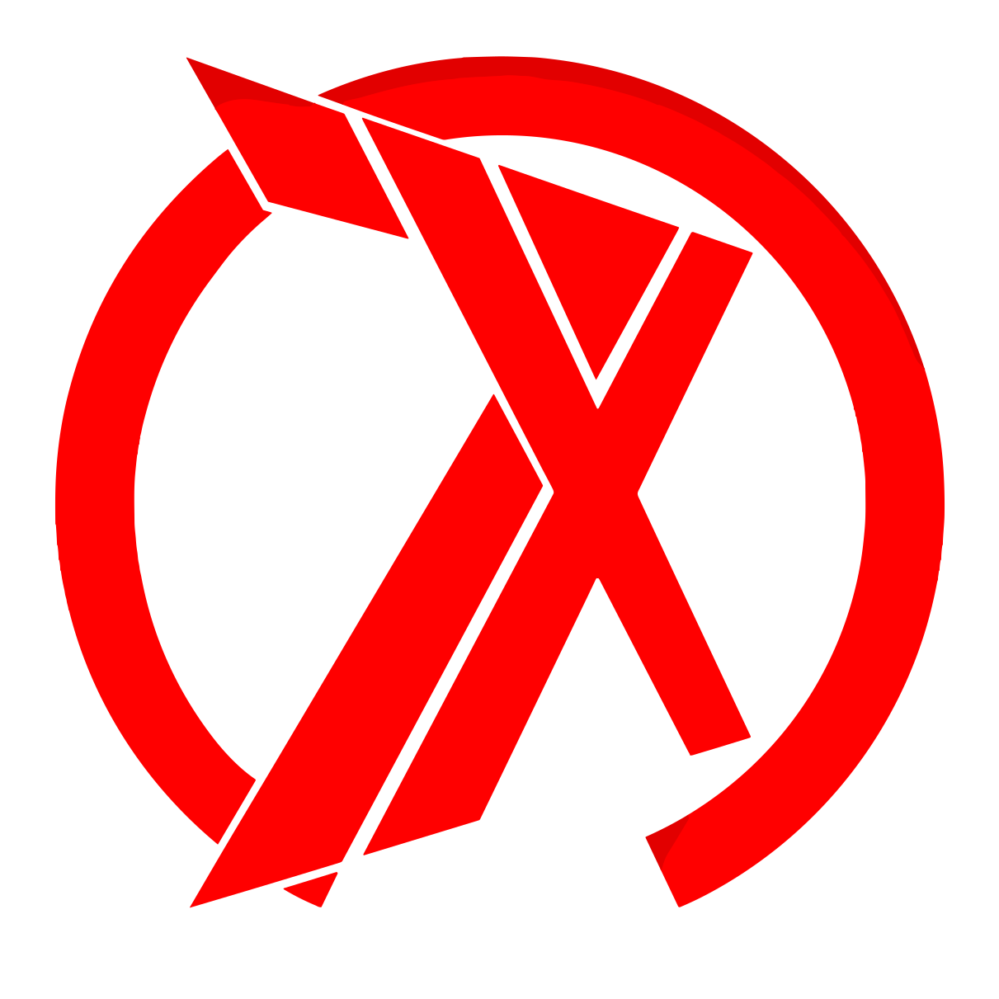

<a name="readme-top"></a>

<!-- PROJECT LOGO -->
<br />
<div align="center">
  <a href="https://github.com/othneildrew/Best-README-Template">
    
  </a>

  <h3 align="center">7x Team League Client</h3>

  <p align="center">
    Client side of the project dedicated to holding team leagues on StartCraft 2 game
    <br />
    <a href="https://github.com/EllectronChik/client7x/issues">Report Bug</a>
    ·
    <a href="https://github.com/EllectronChik/client7x/issues">Request Feature</a>
  </p>
</div>


<!-- TABLE OF CONTENTS -->
<details>
  <summary>Table of Contents</summary>
  <ol>
    <li>
      <a href="#about-the-project">About The Project</a>
      <ul>
        <li><a href="#built-with">Built With</a></li>
      </ul>
    </li>
    <li>
      <a href="#getting-started">Getting Started</a>
      <ul>
        <li><a href="#prerequisites">Prerequisites</a></li>
        <li><a href="#installation">Installation</a></li>
      </ul>
    </li>
    <li><a href="#usage">Usage</a></li>
    <li><a href="#roadmap">Roadmap</a></li>
    <li><a href="#contributing">Contributing</a></li>
    <li><a href="#license">License</a></li>
    <li><a href="#contact">Contact</a></li>
    <li><a href="#acknowledgments">Acknowledgments</a></li>
  </ol>
</details>


<!-- ABOUT THE PROJECT -->
## About The Project

![Product Name Screen Shot][product-screenshot]

This frontend project serves as the interface for a platform dedicated to organizing team leagues for StarCraft 2. Users can register their teams, participate in tournaments, and report match results.

<p align="right">(<a href="#readme-top">back to top</a>)</p>


### Built With

* [![React][React.js]][React-url]
* [![Scss][Sass]][Sass-url]
* [![Typescript][Typescript]][Typescript-url]


<p align="right">(<a href="#readme-top">back to top</a>)</p>


<!-- GETTING STARTED -->
## Getting Started

### Prerequisites

- [ ] Node.js
- [ ] NPM
- [ ] Git

### Installation

<!-- _Below is an example of how you can instruct your audience on installing and setting up your app. This template doesn't rely on any external dependencies or services._

1. Get a free API Key at [https://example.com](https://example.com)
2. Clone the repo
   ```sh
   git clone https://github.com/your_username_/Project-Name.git
   ```
3. Install NPM packages
   ```sh
   npm install
   ```
4. Enter your API in `config.js`
   ```js
   const API_KEY = 'ENTER YOUR API';
   ``` -->

1.Clone the repo
  ```sh
  git clone https://github.com/EllectronChik/client7x.git
  ```
2. Install NPM packages
  ```sh
  npm install
  ```
3. Create .env file with next lines
  ```sh
  VITE_API_URL = http://{{SERVER_URL}}/api/v1/
  VITE_SERVER_URL = http://{{SERVER_URL}}
  VITE_SERVER_WS_URL = ws://{{SERVER_URL}}/ws/
  ```
  If you have a server that is running on port 3000, you can use `localhost:3000` instead of `{{SERVER_URL}}`. <br/>
  If you use https, you can use `https` instead of `http` and `wss` instead of `ws`.

4. Run `npm run dev` to start the dev server or `npm run build` to build the app. <br/>
  Builded app can be found in `dist` folder.

<p align="right">(<a href="#readme-top">back to top</a>)</p>

<!-- MARKDOWN LINKS & IMAGES -->
<!-- https://www.markdownguide.org/basic-syntax/#reference-style-links -->
[product-screenshot]: readmeMedia/screen.png
[React.js]: https://img.shields.io/badge/React-20232A?style=for-the-badge&logo=react&logoColor=61DAFB
[React-url]: https://reactjs.org/
[Sass]: https://img.shields.io/badge/Sass-CC6699?style=for-the-badge&logo=sass&logoColor=white
[Sass-url]: https://sass-lang.com
[Typescript]: https://img.shields.io/badge/Typescript-3178C6?style=for-the-badge&logo=typescript&logoColor=white
[Typescript-url]: https://www.typescriptlang.org